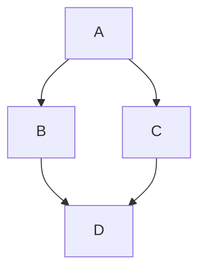

<File isUploading="false">

</File>

<File src="https://api.qa3.archbee.co/api/presign/-ojPTDCxvH0gZVunvkOhv/L2U0ByfPGSija1LoJlBPg-20260320-090636.yml" label="cypress-e2e-tests-pr.yml">

</File>


<embed url="https://youtu.be/I76wvt0aEE4?si=HuIkygpsWHiq6OCW">

</embed>

<Map data="{&#x22;center&#x22;:[37.773972,-122.431297],&#x22;zoom&#x22;:10,&#x22;markerPositions&#x22;:[]}">

</Map>



```tex
int_0^infty x^2 dx
```

<Changelog>
  <ChangelogItem type="added" description="ADDED" />

  <ChangelogItem type="fixed" description="FIXED" />

  <ChangelogItem type="improved" description="IMPROVED" />

  <ChangelogItem type="broken" description="BROKEN" />

  <ChangelogItem type="knownIssue" description="KNOWN ISSUE" />
</Changelog>

/
